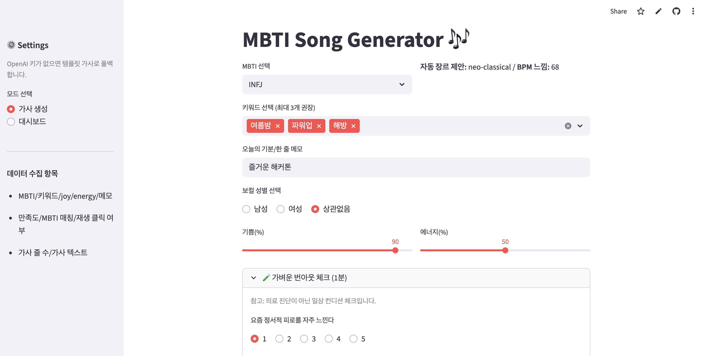

# 🎶 MBTI Song Generator (Streamlit)
[🚀🚀🚀🚀 Live Demo : 클릭하면 데모 사이트로 연결됩니다!🚀🚀🚀🚀](https://hackathonmbtimusicgenerator.streamlit.app/)            
     

- MBTI + 키워드 + 한 줄 메모 → 한국어 가사 생성 → Suno AI(V4_5, 보컬 포함)로 음악 생성 → 스트리밍 & MP3
다운로드
- 제출 버튼으로 Google Sheets에 사용 로그가 저장되고, 공유 링크도 만들 수 있는 해커톤용 MVP입니다.

### ✨ 주요 기능

- OpenAI로 가사 생성 (없으면 템플릿 폴백)
- Suno API V4_5 + 보컬 포함으로 곡 생성, 스트리밍/MP3 다운로드
- 번아웃 미니 체크 + 피드백 문구
- Google Sheets 로깅 + 간단한 대시보드
- 공유 링크 생성


### 🧭 사용 흐름

1. MBTI/키워드/메모/컨디션/보컬 성별 입력 → 가사 생성

2. OpenAI 키가 있으면 LLM, 없으면 템플릿 가사

3. 음악 생성 & 재생 → Suno V4_5(보컬 포함)로 생성

4. 먼저 스트리밍 URL이 나오고, 잠시 후 MP3 다운로드 버튼 활성화

5. 느리면 상태 새로고침으로 taskId 재조회

6. 제출(공유) → Google Sheets 로깅

7. 공유하기 → 추천 링크 생성

### 🧩 구성

- app.py : Streamlit UI, 가사 프롬프트, Suno API 호출(커스텀 모드), 시트 로깅/대시보드

- requirements.txt : 의존성

- README.md : 문서

### 🎛️ 커스터마이즈

- MBTI_STYLE_MAP : MBTI별 장르/BPM 조정

- make_prompt() : 가사 프롬프트 톤/형식 수정

- _mbti_audio_hints() : 악기/무드/그루브/질감 규칙 변경
- (옵션) 실험성(%) 슬라이더를 추가해 BPM 흔들림/모드/악기 수를 늘려 자유도↑

### 🧹 데이터 스키마(시트)

- 앱에서는 아래 헤더 순서로 저장합니다:
```
timestamp, user_id, mbti, keywords, joy, energy, personal_line,
satisfaction, mbti_match, played, lyrics_lines, lyrics,
bo_exhaust, bo_cynicism, bo_burden, bo_anger, bo_fatigue, bo_sleep,
burnout_score, burnout_level, would_return,
page_view_time, button_clicks, revisit, sharing, session_time, "downloaded","download_clicks","audio_size_bytes", "vocal_gender"
```


### 🛟 트러블슈팅
<Suno>
- 400 model cannot be null     
→ payload에 "model": "V4_5" 지정 (빠르고 안정, 보컬 포함은 "instrumental": False)

- Please enter callBackUrl.    
→ payload에 "callBackUrl": "https://example.com/callback" 같은 더미 URL 추가 (폴링 방식과 병행 가능)


- 재생은 되는데 다운로드 버튼이 안 보임    
→ Suno는 보통 streamAudioUrl → audioUrl(mp3) 순으로 도착
→ 잠시 후 자동/수동 새로고침 시 MP3 다운로드 버튼 활성화
→ 서버에서 requests.get(audio_url).content로 받아 st.download_button에 bytes로 전달(CORS 회피)

- 401/403/429    
→ 키 확인, 크레딧/쿨다운 확인, 동시 요청 수 줄이기

<Streamlit / Secrets>
- StreamlitSecretNotFoundError: Unterminated string   
→ TOML 문법 오류. " 짝, 줄바꿈(\n) 처리 확인

<Google Sheets>

- MalformedError: missing fields client_email, token_uri     
→ gcp_service_account 블록 키 누락/오타. 샘플과 동일 키로 채우기

<권한 에러 or 저장 실패>
- → 시트에서 서비스계정 이메일에 편집 권한 공유     
- → 시트 이름/워크시트(sheet1) 확인     

<⏰ 타임존(KST) 이슈>
- **증상**: 시트/대시보드 시간이 9시간 어긋나 보임(UTC 저장), 차트 정렬이 이상함(naive datetime 섞임).
- **해결**: 모든 타임스탬프는 KST(Asia/Seoul) 로 저장/표시.


### PPT


